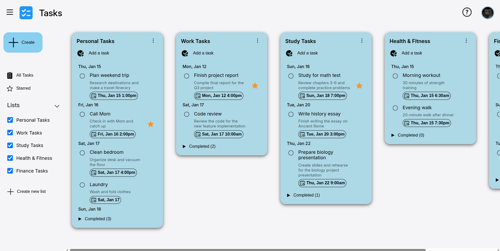

# To-Do List

A simple to-do list web application built with modern JavaScript (ES6 modules) and bundled with Webpack.

## Features

- Create, edit, and delete tasks
- Persist tasks locally using the storage manager
- Responsive UI with a toggleable sidebar
- Human-friendly date/time formatting via `date-fns`

## Tech Stack

- Vanilla JavaScript (ES6 modules)
- Webpack for bundling and dev server
- `date-fns` for date utilities

## Project Structure

Key files and folders:

- `index.html` — app entry HTML
- `src/` — application source code
	- `index.js` — main entry
	- `styles.css` — global styles
	- `components/` — UI components (`list-container.js`, `toggle-sidebar.js`)
	- `data/` — sample data (`dummy-data.json`)
	- `managers/` — app managers (dialog, list, storage, view, visibility)
	- `utils/` — utilities (`date-time-utils.js`)
- `public/images/` — assets and screenshots
- `webpack.*.js` — webpack configs for dev/prod
- `package.json` — scripts and dependencies
